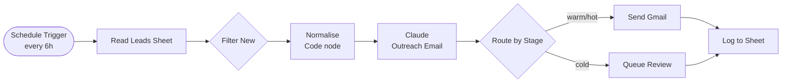
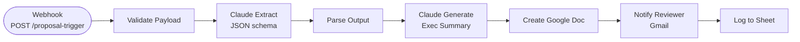
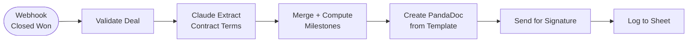

# n8n AI Workflows

[](https://github.com/djmoore-projects/n8n_ai_workflows/actions/workflows/tests.yml)
[](https://www.python.org/)

Three production-oriented AI automation workflows built on n8n, covering the full go-to-market motion from lead outreach to signed contract. Each workflow pairs a Claude LLM with a Python data preparation layer that normalises inputs before they reach the AI — a pattern that reduces hallucination risk and cuts token usage.

---

## Workflows

### 01 · Sales Lead Agent

Scheduled batch processor that pulls new leads from a Google Sheet, generates personalised outreach with Claude, and routes by engagement stage.



[Workflow JSON](workflows/01_sales_lead_agent.json) · [Architecture](docs/01_sales_lead_agent_architecture.md)

---

### 02 · Proposal Generation Agent

Webhook-triggered pipeline that turns a sales call transcript into a reviewed Google Doc proposal draft in two LLM passes: extraction then generation.



[Workflow JSON](workflows/02_proposal_generation_agent.json) · [Architecture](docs/02_proposal_generation_architecture.md)

---

### 03 · Onboarding & Contract Agent

Event-driven contract machine. Fires on "Closed Won" CRM webhook, reasons across both sales and closing call transcripts, generates a PandaDoc contract from a locked template, and sends for e-signature.



[Workflow JSON](workflows/03_onboarding_contract_agent.json) · [Architecture](docs/03_onboarding_contract_architecture.md)

---

## Repository Structure

```
n8n_ai_workflows/
├── workflows/
│   ├── 01_sales_lead_agent.json           # n8n export — credentials stripped
│   ├── 02_proposal_generation_agent.json
│   └── 03_onboarding_contract_agent.json
├── src/
│   └── data_prep/
│       ├── lead_normalizer.py             # normalize_lead(), normalize_leads_csv()
│       └── transcript_parser.py           # parse_transcript(), extract_action_items()
├── tests/
│   ├── test_lead_normalizer.py            # 10 tests: normalization, CSV parsing, edge cases
│   └── test_transcript_parser.py         # 11 tests: speaker detection, action items
├── docs/
│   ├── 01_sales_lead_agent_architecture.md
│   ├── 02_proposal_generation_architecture.md
│   ├── 03_onboarding_contract_architecture.md
│   └── screenshots/                       # replace .gitkeep with actual screenshots
├── .github/workflows/tests.yml            # CI: pytest + ruff on push to main
└── pyproject.toml
```

---

## Design Principles

**Schema-first LLM usage** — Claude is always given an explicit JSON schema to fill. Free-form generation is limited to prose sections (email body, executive summary). This eliminates the class of bugs where parsing LLM output fails in production.

**Pre-processing in Python, not in n8n** — The `src/data_prep` module normalises CRM exports and transcripts before they enter any workflow. Clean, typed input means fewer prompt tokens, more predictable extraction, and easier unit testing.

**Human-in-the-loop gates** — Proposals go to a human reviewer before the client sees them. Contracts are generated from a locked legal template — Claude fills data tokens, never writes contract clauses.

**Swappable data layer** — Google Sheets is used as a lightweight CRM. Every node that reads or writes the Sheet is isolated, making it a one-node swap to replace with HubSpot, Salesforce, or Airtable.

---

## Python Data Prep Layer

```bash
pip install -e ".[dev]"
pytest
```

### `lead_normalizer.py`

```python
from src.data_prep import normalize_lead, normalize_leads_csv

# Single record
lead = normalize_lead({
    "first_name": "  Jane ",
    "email": "JANE@EXAMPLE.COM",
    "source": "LI",          # → "linkedin"
    "stage": "warm",
})

# Batch from CRM CSV export
leads = normalize_leads_csv(open("export.csv").read())
```

### `transcript_parser.py`

```python
from src.data_prep import parse_transcript

result = parse_transcript(open("call.txt").read())
print(result.speakers)              # ["Derek", "Client"]
print(result.duration_estimate_minutes)  # e.g. 14.3
print(result.to_dict()["cleaned_text"])  # filler words removed
```

---

## Tech Stack

| Component | Technology |
|-----------|-----------|
| Orchestration | n8n (self-hosted or cloud) |
| LLM | Anthropic Claude claude-sonnet-4-5 |
| APIs | Google Sheets, Google Docs, Gmail, PandaDoc |
| Data prep | Python 3.10+ |
| Testing | pytest + unittest.mock |
| Linting | ruff + black |
| CI | GitHub Actions |

---

## Security

- All workflow JSONs are exported with credentials removed (`credentials: { id, name }` placeholders only)
- API keys are managed via n8n's built-in credentials store
- No production data is committed to this repository
- Python module uses no network calls — safe for offline testing

---

Built by [Derek Moore](mailto:derek@aismartr.com) · AI Solutions Engineer · [AI Smartr](https://aismartr.com)
