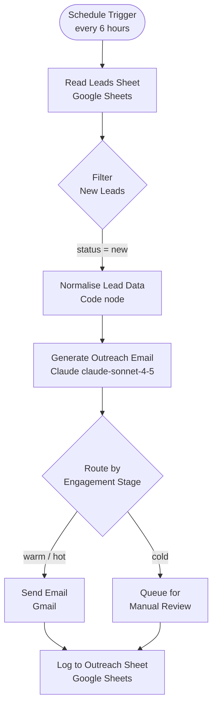

# Sales Lead Agent — Architecture

## Overview

The Sales Lead Agent runs on a 6-hour schedule, pulling unprocessed leads from a Google Sheet, normalising the data, generating personalised outreach with Claude, and routing by engagement stage before logging results.

## Workflow Diagram



## Design Decisions

| Decision | Rationale |
|----------|-----------|
| Schedule trigger (not webhook) | Lead lists are batched exports, not real-time events |
| Code node for normalisation | Pre-processing in n8n avoids passing messy data to Claude, reducing tokens and hallucination risk |
| `temperature: 0.4` | Low enough for professional tone, high enough for natural variation |
| Google Sheets as data layer | Swappable for any CRM with an n8n connector — no vendor lock-in |
| Engagement stage routing | Avoids cold-emailing warm leads and vice versa |

## Data Flow

```
Google Sheet (Leads tab)
  → filter by status=new
  → normalise: trim, lowercase email, resolve source aliases
  → Claude: personalise email body (~150 words)
  → route: warm/hot → send now, cold → queue
  → Google Sheet (Outreach Log tab): record sent_at + body_preview
```

## Environment Variables Required

| Variable | Purpose |
|----------|---------|
| `LEADS_SHEET_ID` | Google Sheet ID containing the lead database |

## Screenshots


