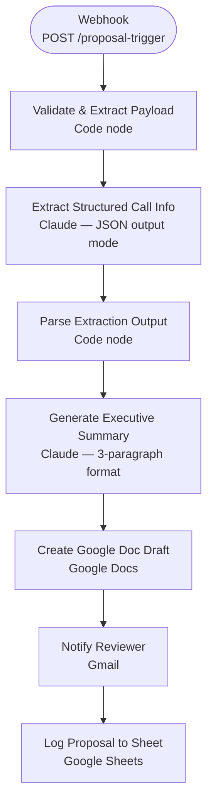

# Proposal Generation Agent — Architecture

## Overview

The Proposal Agent fires on a webhook when a call recording is submitted. It extracts structured information from the transcript using Claude with schema-constrained JSON output, generates an executive summary, creates a Google Doc draft, and routes it to a human reviewer before anything reaches the client.

## Workflow Diagram



## Design Decisions

| Decision | Rationale |
|----------|-----------|
| Two-stage Claude calls | Stage 1 extracts structured data at `temperature: 0.1`. Stage 2 writes prose at `temperature: 0.3`. Separating them prevents the LLM from mixing extraction with generation. |
| Schema-constrained JSON output | Forces Claude to return a predictable object, not free-form text. The Code node validates the parse and throws on malformed output. |
| Human-in-the-loop review step | Proposals are sent to a reviewer before client delivery. Critical for brand risk and contractual accuracy. |
| Google Doc (not email direct) | Gives the reviewer a living document they can edit collaboratively before approval. |

## Extraction Schema

The first Claude call returns JSON matching:

```json
{
  "pain_points": ["string"],
  "goals": ["string"],
  "budget_signals": "string",
  "timeline": "string",
  "decision_makers": ["string"],
  "objections": ["string"],
  "recommended_services": ["string"],
  "next_steps": ["string"]
}
```

## Environment Variables Required

| Variable | Purpose |
|----------|---------|
| `PROPOSALS_FOLDER_ID` | Google Drive folder ID for draft documents |
| `LEADS_SHEET_ID` | Sheet ID for the Proposals log tab |
| `REVIEW_EMAIL` | Email address of the human reviewer |

## Screenshots


