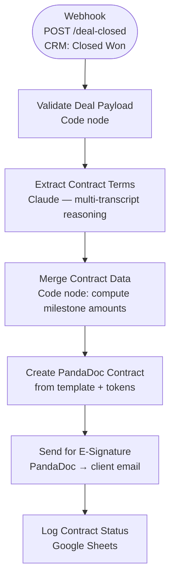

# Onboarding & Contract Agent — Architecture

## Overview

The Contract Agent triggers on a "Closed Won" CRM webhook. It parses both the sales and closing call transcripts to extract contract terms, computes milestone payment schedules, generates a PandaDoc contract from a template, sends it for e-signature, and logs the result.

## Workflow Diagram



## Design Decisions

| Decision | Rationale |
|----------|-----------|
| Multi-transcript input | Both the sales call and closing call are passed together so Claude can reconcile any discrepancies between what was promised and what was agreed at close. |
| Milestone calculation in Code node | Arithmetic is deterministic — doing it in code rather than asking Claude prevents rounding errors. |
| PandaDoc template + tokens | Keeps legal language locked in the template (version-controlled separately). Claude only fills data tokens, never writes contract clauses. |
| `termination_notice_days` defaults to 30 | Conservative safe default if the transcript doesn't specify. |

## Contract Term Extraction Schema

```json
{
  "services_agreed": ["string"],
  "deliverables": ["string"],
  "milestones": [
    { "name": "string", "due_weeks": 2, "payment_pct": 50 }
  ],
  "exclusions": ["string"],
  "special_terms": ["string"],
  "ip_ownership": "string",
  "termination_notice_days": 30
}
```

## Milestone Payment Logic

```
milestone.payment_amount = deal_value × (payment_pct / 100)
milestone.due_date = start_date + due_weeks × 7 days
```

## Environment Variables Required

| Variable | Purpose |
|----------|---------|
| `LEADS_SHEET_ID` | Sheet ID for the Contracts log tab |
| `PANDADOC_TEMPLATE_ID` | PandaDoc template ID for the service agreement |

## Screenshots


